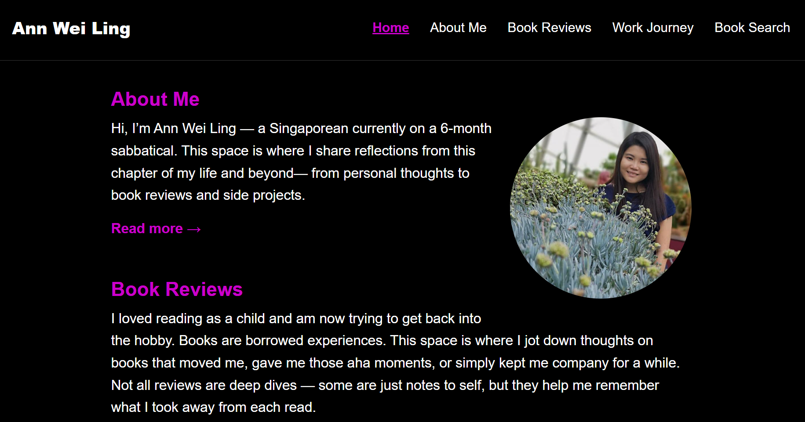

# Personal Website — Ann Wei Ling



## App Name and Description

This is a full-stack React + Flask portfolio site where I share reflections, book reviews, and my career journey. It serves as a personal platform to document learning, favorite reads, and experiences — while building out end-to-end functionality including user authentication, CRUD features, and styling.

## Features

- **Homepage**: Overview of site sections
- **About Me**: Background and sabbatical reflections
- **Book Reviews**:
  - Submit/edit/delete your reviews with rating
  - View full review details with comments and bookmarks
  - Admin interface to manage users and book reviews
- **Work Journey**: Career history and pivots
- **Personal Reflections**: Notes and thoughts (planned)

## Tech Stack

### Frontend:

- React (with Vite)
- React Router
- Custom CSS Modules
- Framer Motion (animations)

### Backend:

- Python Flask
- PostgreSQL
- JWT Auth + Role-based permissions

## Project Structure

```
personal-website/
│
├── backend/                         # Flask application
│   ├── app/
│   │   ├── routes/                  # All route blueprints
│   │   │   ├── auth_routes.py
│   │   │   ├── book_routes.py
│   │   │   ├── bookmark_routes.py
│   │   │   ├── comment_routes.py
│   │   │   ├── tag_routes.py
│   │   ├── crud/                    # All DB logic (SQL) per feature
│   │   ├── db/                      # Connection setup
│   │   ├── middleware/              # Token middleware
│   │   └── __init__.py
│   ├── .env                         # Environment config
│   └── main.py                      # App entrypoint (flask run)

├── frontend/                        # React application (Vite)
│   ├── src/
│   │   ├── components/
│   │   │   ├── Auth/               # Login, Register
│   │   │   ├── BookEditor/         # Create/edit reviews
│   │   │   ├── BookReviewsMeta/    # All preview cards
│   │   │   ├── FullBookReview/     # Full view incl. comments/bookmark
│   │   │   ├── Admin/              # Admin dashboard
│   │   │   ├── NavBar/             # Navigation bar
│   │   │   ├── AboutMe/            # AboutMe Page
│   │   │   ├── WorkJourney/        # Chronicles of my work history
│   │   │   └── HomePage/           # Homepage
│   │   ├── assets/                 # Images, screenshots, icons
│   │   ├── App.jsx
│   │   └── main.jsx
│   └── index.html
├── package.json                     # Frontend dependencies
└── README.md
```

## Getting Started

### Backend

1. Navigate to the backend directory and set up a virtual environment:

   ```bash
   python -m venv venv
   source venv/bin/activate  # or venv\Scripts\activate on Windows
   pip install -r requirements.txt
   ```

2. Add a `.env` file for your Flask app with keys like:

   ```env
   DB_NAME=your_db_name
   DB_USER=your_db_user_account
   DB_PASSWORD=your_db_password
   DB_HOST=your_db_host
   DB_PORT=your_db_port
   JWT_SECRET=your_jwt_secret
   ```

3. Start the Flask server:
   ```bash
   $env:FLASK_APP = "main.py"
   flask run
   ```

### Frontend

1. From the frontend root:

   ```bash
   npm install
   npm run dev
   ```

2. The app will run at `http://localhost:5173/`

## Highlights

- **JWT auth** with role-based access (`owner`, `registered`, public)
- **Admin panel and Book Editor**: promote/demote users, edit/delete reviews
- **Comment system**: create/edit/delete with user roles
- **Bookmark** feature for logged-in users

## Roadmap / Ideas

- Responsive navigation (hamburger for mobile)
- Filter reviews by tag or rating
- Personal Reflections section buildout
- Theme toggle (light/dark)
- Pagination and sorting for reviews

## License

This project is open for personal learning and portfolio development. Please credit if reusing major components.
